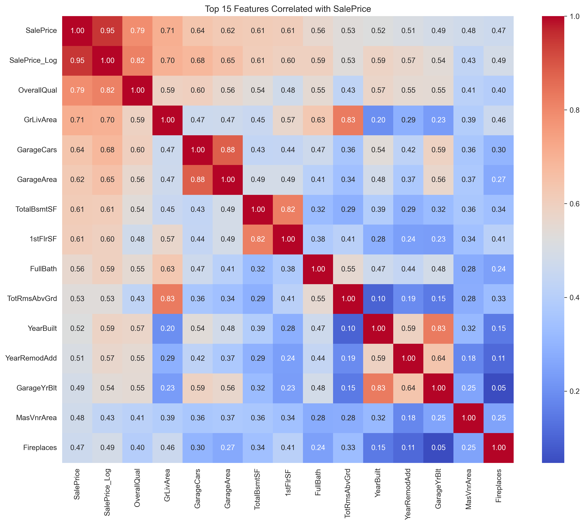
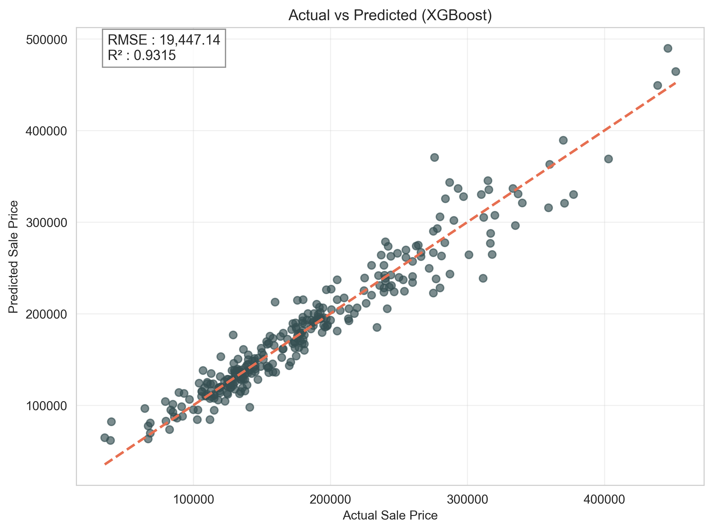
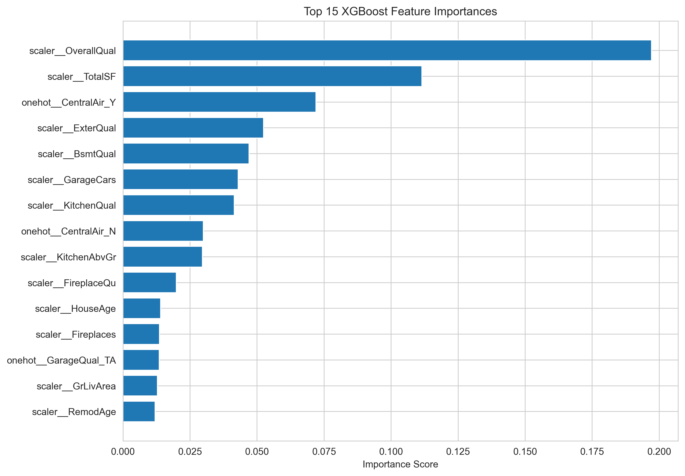
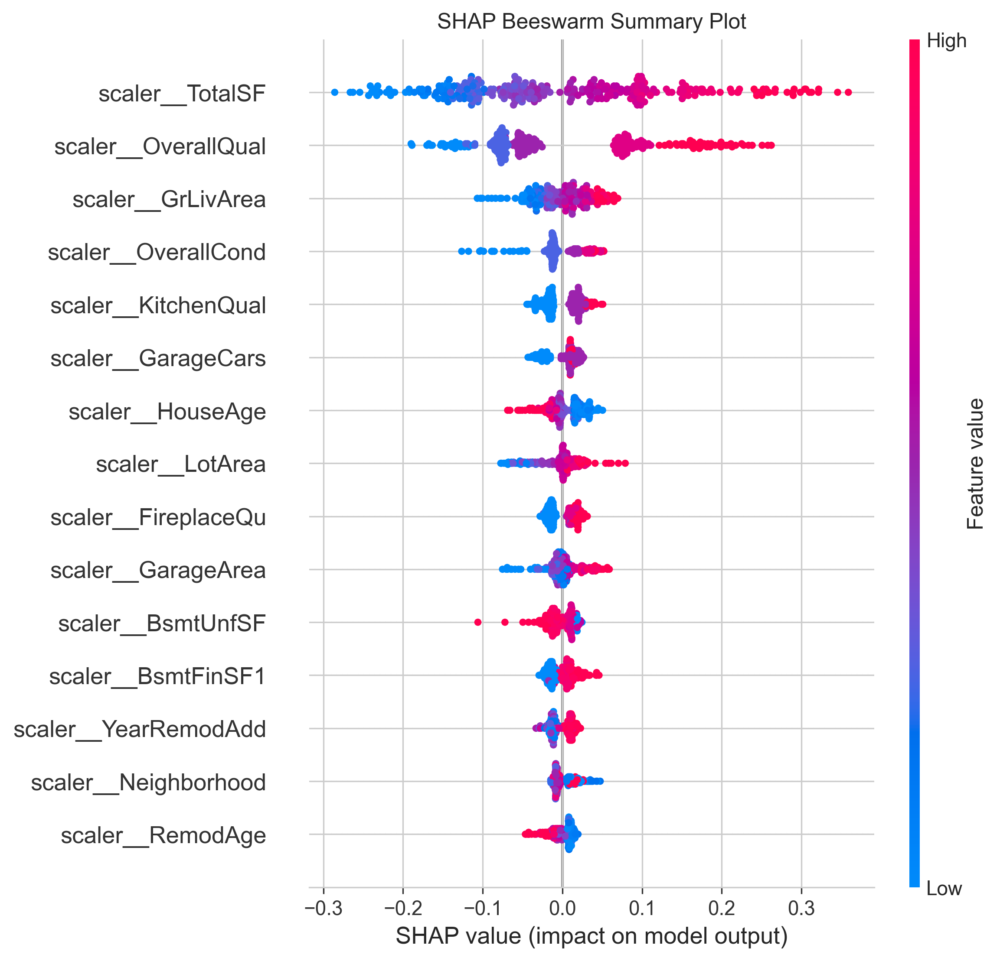

<h1 align="center">
🏡 House Price Prediction using Supervised Learning
</h1>

<p align="center">
An End-to-End Machine Learning Regression Pipeline for Residential House Price Prediction
</p>

<p align="center">


</p>


> **An End-to-End Machine Learning Regression Pipeline for Residential House Price Prediction**

Predicting residential property prices using **Linear Regression, Ridge Regression, Lasso Regression, Random Forest, and XGBoost**, combined with feature engineering, hyperparameter tuning, model interpretation, and deployment-ready pipelines.

---

## 🌐 Live Demo

👉 **Try the Web Application:** 
[House Price Prediction WebApp](https://house-price-prediction-webapp.streamlit.app/)

---

## 🎥 Project Demonstration

A complete walkthrough of the project covering the notebook, model training, evaluation, GitHub repository, and web application.

📹 **Project Demo Video:**  
https://drive.google.com/file/d/1qAc-wc_-ln8N9FICaMZEO7c1ZzHC-emq/view?usp=drive_link


---

## 📌 Project Overview

Accurately estimating residential property prices is an important problem in the real estate industry. Property valuation depends on numerous structural, geographical, and quality-related factors, making it a suitable application of supervised machine learning.

This project develops a complete regression pipeline using the **Ames Housing Dataset**, covering the full machine learning lifecycle—from data exploration and preprocessing to model comparison, hyperparameter tuning, interpretation, and deployment.

Multiple regression algorithms are evaluated, with the final model selected based on predictive performance using **RMSE**, **MAE**, **R² Score**, and **Cross-Validation**.

---

## 🎯 Objectives

- Perform comprehensive Exploratory Data Analysis (EDA)
- Handle missing values and outliers
- Engineer meaningful predictive features
- Train and compare multiple regression algorithms
- Optimize the best-performing model using RandomizedSearchCV
- Interpret predictions using Feature Importance and SHAP values
- Save a deployment-ready machine learning pipeline
- Build a Streamlit web application for real-world predictions

---

## ✨ Key Features

- 📊 Complete Exploratory Data Analysis (EDA)
- 🧹 Missing Value Handling
- 📈 Outlier Detection & Removal
- ⚙️ Feature Engineering
- 🔤 Feature Encoding & Scaling
- 📉 Target Variable Transformation
- 🤖 Multiple Regression Models
- 🎯 Hyperparameter Tuning
- 📊 Cross Validation
- 📈 Residual Analysis
- 🔍 SHAP Explainability
- 💾 Model Serialization using Joblib
- 🌐 Deployment-ready Pipeline

---

## 🛠️ Tech Stack

| Category | Technologies |
|----------|--------------|
| **Programming Language** | Python |
| **Data Manipulation** | NumPy, Pandas |
| **Data Visualization** | Matplotlib, Seaborn |
| **Statistical Analysis** | SciPy |
| **Machine Learning** | Scikit-learn, XGBoost |
| **Model Interpretation** | SHAP |
| **Model Serialization** | Joblib |
| **Development Environment** | Jupyter Notebook, VS Code |
| **Deployment** | Streamlit Community Cloud |

---

## 🤖 Regression Models Implemented

The following supervised learning regression algorithms were trained and evaluated:

- 📈 Linear Regression
- 📉 Ridge Regression (L2 Regularization)
- 📉 Lasso Regression (L1 Regularization)
- 🌲 Random Forest Regressor
- 🚀 XGBoost Regressor

The final model was selected after evaluating each algorithm using multiple performance metrics and cross-validation.

---

## 🔄 Machine Learning Workflow

```text
Problem Framing
        │
        ▼
Dataset Loading
        │
        ▼
Exploratory Data Analysis
        │
        ▼
Missing Value Treatment
        │
        ▼
Outlier Detection & Removal
        │
        ▼
Feature Engineering
        │
        ▼
Encoding & Scaling
        │
        ▼
Train-Test Split
        │
        ▼
Model Training
        │
        ▼
Hyperparameter Tuning
        │
        ▼
Model Evaluation
        │
        ▼
Residual Analysis
        │
        ▼
SHAP Explainability
        │
        ▼
Pipeline Serialization
        │
        ▼
Deployment
```

---

## 📊 Dataset Information

| Attribute | Details |
|-----------|---------|
| **Dataset** | Ames Housing Dataset |
| **Records** | 1,460 |
| **Features** | 80 Input Features |
| **Target Variable** | SalePrice |
| **Problem Type** | Supervised Machine Learning - Regression |

The dataset contains structural, neighborhood, quality, and property-related characteristics used to predict residential house prices.

---

## 📂 Project Structure

```text
house-price-regression-supervised-learning/
│
├── data/
│   └── House_Price_Prediction_Dataset.csv
│
├── models/
│   └── house_price_model.pkl
│
├── notebooks/
│   └── HousePrice_SupervisedLearning.ipynb
│
├── reports/
|   ├── figures/
│   |   ├── best_model_actual_vs_predicted.png
│   |   ├── boxplots_saleprice.png
│   |   ├── categorical_countplots.png
│   |   ├── lasso_top20_coefficients.png
│   |   ├── linear_actual_vs_predicted.png
│   |   ├── model_comparison_r2.png
│   |   ├── numerical_features_histograms.png
│   |   ├── outliers_grlivarea.png
│   |   ├── random_forest_feature_importance.png
│   |   ├── residual_histogram.png
│   |   ├── residual_qqplot.png
│   |   ├── residuals_vs_fitted.png
│   |   ├── ridge_top20_coefficients.png
│   |   ├── saleprice_distribution_after_log.png
│   |   ├── saleprice_distribution_before_log.png
│   |   ├── scatterplots_saleprice.png
│   |   ├── top5_feature_importance.png
│   |   ├── top15_correlation_heatmap.png
│   |   ├── xgboost_feature_importance.png
│   |   ├── shap_beeswarm.png
│   |   └── shap_waterfall.png
|   └── summary_report.md
│
├── requirements.txt
└── README.md
```

---

## 📁 Repository Contents

| 📄 Resource | 🔗 Description |
|-------------|----------------|
| 📓 [Jupyter Notebook](notebooks/HousePrice_SupervisedLearning.ipynb) | Complete end-to-end machine learning workflow |
| 📊 [Dataset](data/House_Price_Prediction_Dataset.csv) | Ames Housing dataset used for training and evaluation |
| 🧠 [Trained Model](models/house_price_model.pkl) | Serialized deployment-ready machine learning pipeline |
| 📝 [Summary Report](reports/summary_report.md) | Executive summary of methodology, results, and findings |
| 📈 [Figures](reports/figures/) | All generated visualizations, plots, and model analysis |
| 📋 [Requirements](requirements.txt) | Python dependencies required to reproduce the project |
| 📖 [README](README.md) | Project documentation and setup guide |

---

## 📈 Model Performance

| Model | RMSE | MAE | R² Score |
|------|------:|------:|------:|
| Linear Regression | 23,432.14 | 16,117.76 | 0.9006 |
| Ridge Regression | 20,547.41 | 14,705.28 | 0.9236 |
| Lasso Regression | 20,086.30 | 14,675.93 | 0.9270 |
| Random Forest | 23,332.12 | 16,322.72 | 0.9014 |
| **⭐ XGBoost** | **19,447.14** | **13,994.36** | **0.9315** |

### 🏆 Best Performing Model

Among all evaluated models, **XGBoost Regressor** achieved the highest predictive performance with an **R² Score of 0.9315**, while also producing the **lowest RMSE (19,447.14)** and **lowest MAE (13,994.36)**. Its ability to model complex non-linear relationships made it the most suitable algorithm for this house price prediction task.

---

## 📷 Project Results

### 📌 Correlation Heatmap

<p align="center">

</p>

> Shows the strongest correlations between numerical features and **SalePrice**, helping identify the most influential predictors.

---

### 📌 Actual vs Predicted (Best Model)

<p align="center">

</p>

> Demonstrates the predictive accuracy of the final XGBoost model. Points closer to the diagonal line indicate more accurate predictions.

---

### 📌 XGBoost Feature Importance

<p align="center">

</p>

> Highlights the most influential variables contributing to house price prediction, providing insight into how the model makes decisions.

---

### 📌 SHAP Beeswarm Summary

<p align="center">

</p>

> Visualizes the global contribution of each feature to model predictions. Feature color and position indicate how different values impact predicted house prices.

---

## ⚙️ Installation

Clone the repository:

```bash
git clone https://github.com/PareeSojitra0803/House_Price_Regression_Supervised_Learning.git
```

Navigate to the project directory:

```bash
cd House_Price_Regression_Supervised_Learning
```

Install the required dependencies:

```bash
pip install -r requirements.txt
```

---

## ▶️ How to Run

Launch Jupyter Notebook:

```bash
jupyter notebook
```

Open:

```text
notebooks/
└── HousePrice_SupervisedLearning.ipynb
```

Run all notebook cells sequentially to reproduce the complete machine learning workflow, compare regression models, evaluate performance, interpret predictions, and generate the deployment-ready pipeline.

---

## 🚀 Future Improvements

The current project establishes a complete supervised learning pipeline for house price prediction. Future enhancements could include:

- 🌐 Deploying the model as an interactive Streamlit web application
- 📍 Incorporating geospatial features such as latitude and longitude
- 📊 Experimenting with CatBoost and LightGBM regressors
- ⚡ Building a real-time prediction API using FastAPI
- ☁️ Deploying the application on Streamlit Community Cloud or Hugging Face Spaces
- 📈 Integrating interactive dashboards using Plotly


---

## 🛠️ Technologies Used

| Category | Technologies |
|-----------|--------------|
| **Programming Language** | Python |
| **Data Analysis** | NumPy, Pandas |
| **Visualization** | Matplotlib, Seaborn |
| **Statistical Analysis** | SciPy |
| **Machine Learning** | Scikit-learn |
| **Gradient Boosting** | XGBoost |
| **Model Explainability** | SHAP |
| **Model Serialization** | Joblib |
| **Development Environment** | Jupyter Notebook, VS Code |
| **Deployment** | Streamlit Community Cloud |


---

## 👩‍💻 Author

***Paree Sojitra***

>Aspiring **AI / ML & Data Science Engineer** passionate about building practical machine learning solutions and deploying them as real-world applications.


---
